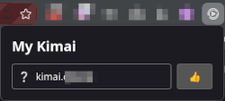
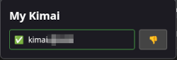
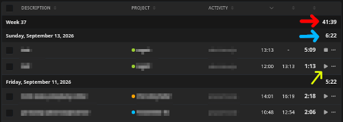
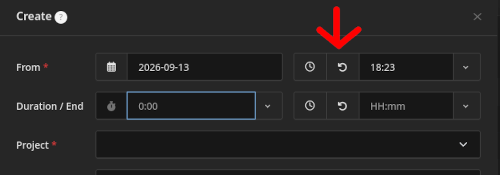
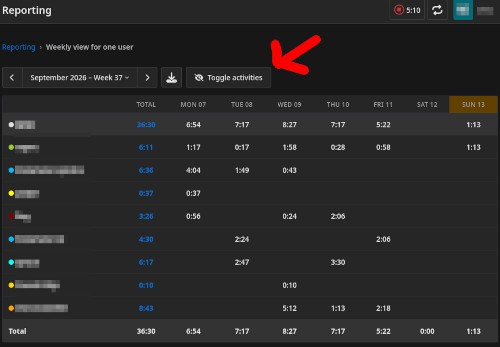
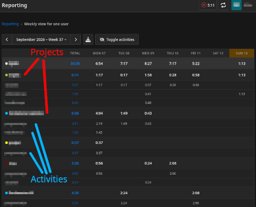

# My Kimai

Browser extension for improving Kimai (the time-tracker).

---

## Usage

To grant permission and enable the extension on your kimai domain:
- go to your kimai url (eg. kimai.yourcompany.com)
- click the extension icon
- click the thumbs up button and allow the permission

To revoke the permission and disable the extension on your kimai domain:
- go to your kimai url (eg. kimai.yourcompany.com)
- click the extension icon
- click the thumbs down button to revoke the permission
- after refreshing the page extension will no longer run on that domain

---

## Features

### My times:

- reorders and resizes columns for better overview (like clockify)
  - see screenshot below
- shows weekly and daily time summary
  - shown with the red and blue arrows on the screenshot
- adds quick actions to restart a previous task or stop the current one
  - shown with the yellow arrow on the screenshot

---

### Create/Edit task:

- add button that selects the time of the last finished task
  - useful when adding new entry that starts right after previous task and ends now
  - shown on screenshot with the red arrow
- fixes a problem that you couldn't press enter to submit sometimes
  - if you write eg. "12" or "1015" in to the time field you would need to click outside of the field before time was "fixed" to "12:00" or "10:15" and then you could save; now you can just press enter right after typing
  - not shown on screenshot

---

### Reporting views:

- add a button to the reporting views that toggle visibility of activities in the table for a better project overview
  - shown on screenshot with the red arrow; in the first screenshot activity rows are hidden and in the second one they are shown
- changes the color of activity rows (when shown) in the table so you can distiguish projects rows from acivity rows at a glance.
  - shown on the second screenshot, project and activity rows are marked

---
